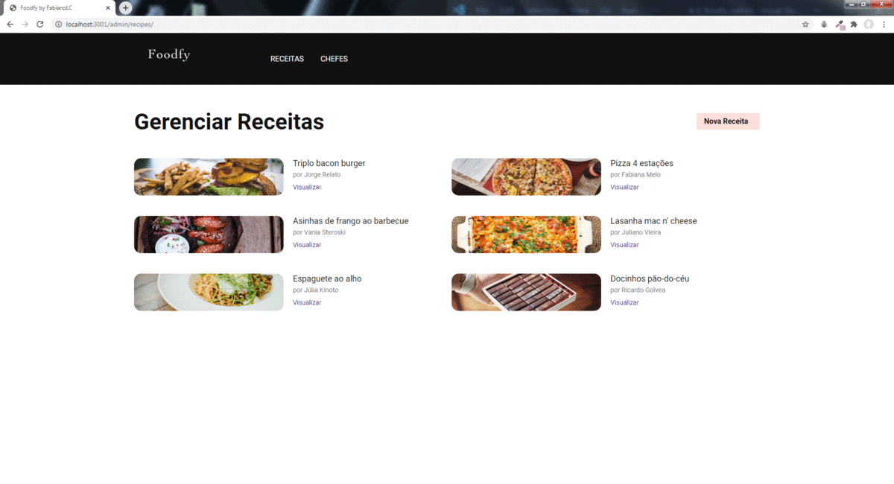

<h1 align="center">
    
</h1>

<h2 align="center">
    Fabiano Luizon Campos
</h2>

<h3 align="center">
    Software Developer
</h3>

---

https://github.com/FabianoLuizonCampos/lauchbase-4-0-foodfy-admin.git

---

## 👾 About
`Foodfy Admin`  - Food site, now an administrative area has been added to register recipes. That´s a challenge from Rocketseat's Lauchbase Bootcamp !!!

## 🖥️ Screenshots

<h1 align="center">
    
</h1>

## Setup for Web Site

1. First clone de repository - If you need help acess: https://help.github.com/pt/github/creating-cloning-and-archiving-repositories/cloning-a-repository
2. Open your computer´s terminal and change to folder that was cloned
3. You already have NodeJs installed in you computer;
4. Install in terminal with line commands  
5. `npm install express`
6. `npm install nodemon -D`
7. `npm install nunjucks`
8.`npm install method-override`
8. Then you can start server
9. `npm start`
10. In browser go to url: `localhost:5000`

## ✔️ Languages Used
- HTML
- CSS
- JavaScript 
- Node / Express
- Nunjucks - Template Engine

## 📇 Contacts
- <a href="https://github.com/FabianoLuizonCampos" target="_blank">Github</a>
- <a href="https://www.linkedin.com/in/fabianoluizoncampos" target="_blank">LinkedIn</a>
- <a href="mailto:fabianoluizoncampos@gmail.com" target="_blank">Email</a>
